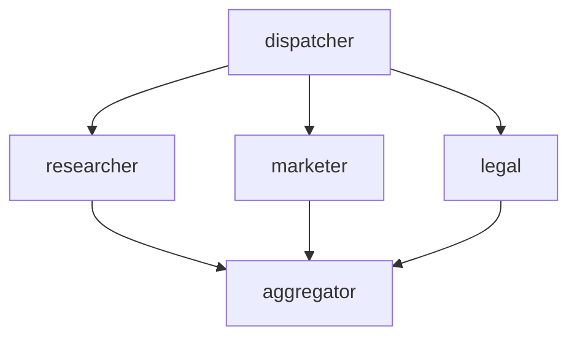
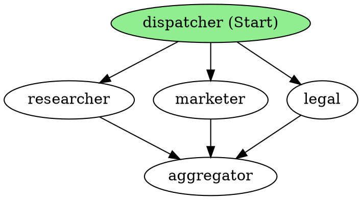

# Agent Framework Workflow 視覺化功能使用範例

## 📋 安裝需求

```bash
# 1. 安裝視覺化支援
pip install agent-framework[viz] --pre

# 2. 安裝 GraphViz (用於匯出圖片)
# Windows: https://graphviz.org/download/
# Mac: brew install graphviz
# Linux: sudo apt-get install graphviz
```

---

## 🎯 使用的檔案位置

### Python 範例
1. **視覺化範例**: `python/samples/getting_started/workflows/visualization/concurrent_with_visualization.py`
2. **平行處理範例**: `python/samples/getting_started/workflows/parallelism/map_reduce_and_visualization.py`
3. **測試檔案**: `python/packages/core/tests/workflow/test_viz.py`

### .NET 範例
- **測試檔案**: `dotnet/tests/Microsoft.Agents.AI.Workflows.UnitTests/WorkflowVisualizerTests.cs`

---

## 💡 完整使用方式

### 基本用法

```python
from agent_framework import WorkflowBuilder, WorkflowViz

# 建立 workflow
workflow = WorkflowBuilder()...build()

# 建立視覺化物件
viz = WorkflowViz(workflow)
```

### 三種輸出方式

#### 1️⃣ Mermaid 格式 (可用於 Markdown/GitHub)

```python
mermaid_string = viz.to_mermaid()
print("Mermaid diagram:")
print(mermaid_string)
```

**輸出範例:**


#### 2️⃣ DiGraph DOT 格式 (GraphViz)

```python
digraph_string = viz.to_digraph()
print("DiGraph representation:")
print(digraph_string)
```

**輸出範例:**


#### 3️⃣ 匯出圖片檔案 ⭐

```python
# SVG 向量圖 (推薦)
svg_file = viz.export(format="svg")
print(f"SVG 已儲存至: {svg_file}")

# PNG 點陣圖
png_file = viz.export(format="png")

# PDF 文件
pdf_file = viz.export(format="pdf")

# DOT 原始檔
dot_file = viz.export(format="dot")

# 自訂檔案名稱和路徑
custom_file = viz.export(format="svg", filename="./diagrams/my_workflow.svg")
```

---

## 📚 實際範例 1: 簡單的視覺化

```python
import asyncio
from agent_framework import WorkflowBuilder, WorkflowViz
from agent_framework.azure import AzureOpenAIChatClient
from azure.identity import AzureCliCredential

async def main():
    # 建立 agents
    chat_client = AzureOpenAIChatClient(credential=AzureCliCredential())
    writer = chat_client.create_agent(instructions="You are a writer.", name="writer")
    reviewer = chat_client.create_agent(instructions="You are a reviewer.", name="reviewer")
    
    # 建立 workflow
    workflow = (
        WorkflowBuilder()
        .set_start_executor(writer)
        .add_edge(writer, reviewer)
        .build()
    )
    
    # 視覺化
    print("=== Workflow Visualization ===\n")
    viz = WorkflowViz(workflow)
    
    # 輸出 Mermaid
    print("Mermaid diagram:")
    print(viz.to_mermaid())
    print()
    
    # 輸出 DiGraph
    print("DiGraph:")
    print(viz.to_digraph())
    print()
    
    # 匯出圖片
    try:
        svg_file = viz.export(format="svg")
        print(f"✓ 圖表已匯出: {svg_file}\n")
    except ImportError:
        print("⚠ 請安裝: pip install agent-framework[viz] --pre")
    except Exception as e:
        print(f"⚠ 匯出失敗: {e}")
    
    # 執行 workflow
    result = await workflow.run("Write about AI")
    print(f"Result: {result.get_outputs()}")

if __name__ == "__main__":
    asyncio.run(main())
```

---

## 📚 實際範例 2: 複雜的 Fan-out/Fan-in

```python
from agent_framework import (
    WorkflowBuilder,
    WorkflowViz,
    Executor,
    WorkflowContext,
    handler
)

class DispatchExecutor(Executor):
    @handler
    async def dispatch(self, prompt: str, ctx: WorkflowContext) -> None:
        # 分派邏輯
        pass

class AggregateExecutor(Executor):
    @handler
    async def aggregate(self, results: list, ctx: WorkflowContext) -> None:
        # 聚合邏輯
        pass

async def main():
    # 建立執行器
    dispatcher = DispatchExecutor(id="dispatcher")
    researcher = MockExecutor(id="researcher")
    marketer = MockExecutor(id="marketer")
    legal = MockExecutor(id="legal")
    aggregator = AggregateExecutor(id="aggregator")
    
    # 建立 fan-out/fan-in workflow
    workflow = (
        WorkflowBuilder()
        .set_start_executor(dispatcher)
        .add_fan_out_edges(dispatcher, [researcher, marketer, legal])
        .add_fan_in_edges([researcher, marketer, legal], aggregator)
        .build()
    )
    
    # 視覺化
    print("Generating workflow visualization...")
    viz = WorkflowViz(workflow)
    
    # 輸出所有格式
    print("Mermaid string:")
    print(viz.to_mermaid())
    print("\nDiGraph string:")
    print(viz.to_digraph())
    
    # 匯出多種格式
    try:
        svg_file = viz.export(format="svg")
        png_file = viz.export(format="png")
        pdf_file = viz.export(format="pdf")
        print(f"\n✓ SVG: {svg_file}")
        print(f"✓ PNG: {png_file}")
        print(f"✓ PDF: {pdf_file}")
    except ImportError:
        print("⚠ Install viz extra: pip install agent-framework[viz] --pre")
```

---

## 🔍 錯誤處理

```python
try:
    svg_file = viz.export(format="svg")
    print(f"✓ 成功匯出: {svg_file}")
except ImportError:
    print("⚠ 請安裝視覺化套件:")
    print("   pip install agent-framework[viz] --pre")
    print("   並安裝 GraphViz: https://graphviz.org/download/")
except FileNotFoundError:
    print("⚠ 找不到 GraphViz，請確認已安裝並加入 PATH")
except Exception as e:
    print(f"⚠ 匯出失敗: {e}")
```

---

## 🎨 視覺化特點

### 自動標示
- **起始節點**: 顯示 `(Start)` 標籤，背景為淺綠色
- **邊緣類型**: 顯示條件邊緣的條件
- **子工作流程**: 顯示嵌套的 workflow 結構

### 支援的 Workflow 元素
- ✅ 基本邊緣 (simple edges)
- ✅ 條件邊緣 (conditional edges)
- ✅ Fan-out 邊緣 (扇出)
- ✅ Fan-in 邊緣 (扇入)
- ✅ Edge Groups (邊緣群組)
- ✅ Sub-workflows (子工作流程)
- ✅ Self-loop edges (自循環邊緣)

---

## 📁 匯出格式說明

| 格式 | 說明 | 使用場景 |
|------|------|----------|
| `svg` | 向量圖 | 網頁顯示、文件 (推薦) |
| `png` | 點陣圖 | 簡報、Email |
| `pdf` | PDF 文件 | 正式文件、報告 |
| `dot` | GraphViz 原始碼 | 進階自訂、除錯 |

---

## 🚀 進階用法

### 在 Jupyter Notebook 中顯示

```python
from IPython.display import SVG, display

viz = WorkflowViz(workflow)
svg_data = viz.export(format="svg")
display(SVG(svg_data))
```

### 批次匯出多個格式

```python
formats = ["svg", "png", "pdf", "dot"]
for fmt in formats:
    try:
        file_path = viz.export(format=fmt, filename=f"workflow.{fmt}")
        print(f"✓ {fmt.upper()}: {file_path}")
    except Exception as e:
        print(f"✗ {fmt.upper()}: {e}")
```

### 自訂輸出路徑

```python
import os

# 建立輸出目錄
os.makedirs("./diagrams", exist_ok=True)

# 匯出到指定目錄
svg_file = viz.export(
    format="svg",
    filename="./diagrams/my_workflow_v1.svg"
)
```

---

## 📖 參考資源

- **官方文件**: [Workflows Documentation](../../../docs/workflows.md)
- **範例目錄**: `python/samples/getting_started/workflows/`
- **測試檔案**: `python/packages/core/tests/workflow/test_viz.py`
