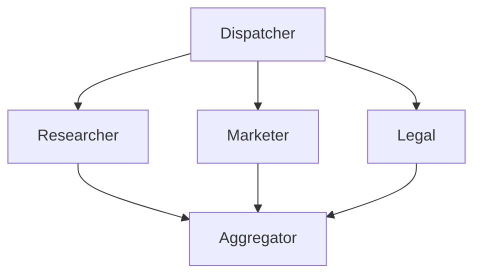

# Agent Framework Workflows 完整技術指南

## Summary

本文檔涵蓋了 Agent Framework 中工作流程 (Workflows) 的所有核心概念和實作模式，從基礎的執行器 (Executor) 和邊 (Edge) 到複雜的並行處理、檢查點持久化、人機互動等進階功能。

### 技術架構總覽
- **基礎框架**: Agent Framework
- **執行環境**: Workflow Runtime
- **構建工具**: WorkflowBuilder (流暢式 API)
- **AI 服務**: Azure OpenAI Chat Client
- **可視化**: WorkflowViz (Mermaid 和 GraphViz 支援)

### 主要功能模組
| 模組 | 適用場景 | 核心技術 | 特色功能 |
| ---- | -------- | -------- | -------- |
| **基礎模式** | 工作流程建構 | Executor、Edge、Context | 狀態管理、訊息傳遞 |
| **Agent 整合** | AI Agent 協作 | AgentExecutor、串流 | 非阻塞、事件驅動 |
| **編排模式** | 多 Agent 協調 | Concurrent、Sequential、Magentic | 並行、順序、智能規劃 |
| **控制流程** | 條件分支、循環 | EdgeCondition、Loop | 動態路由、反饋機制 |
| **並行處理** | 大規模任務 | Fan-out/Fan-in、Map-Reduce | 分散式處理、結果聚合 |
| **檢查點** | 容錯與恢復 | Checkpoint Storage | 持久化、斷點續傳 |
| **人機互動** | 需人工審核 | RequestInfoExecutor | 暫停/恢復、互動式輸入 |
| **可視化** | 流程圖示 | WorkflowViz | Mermaid、SVG 輸出 |

---

## 1. 基礎模式 (_start-here)

### 主要情境
建立工作流程的基本模式，理解執行器 (Executor)、邊 (Edge) 和上下文 (WorkflowContext) 的核心概念。

### 技術特色
- **執行器定義**: 類別繼承或函數裝飾器兩種方式
- **訊息傳遞**: ctx.send_message() 串接節點
- **輸出生成**: ctx.yield_output() 產生最終結果
- **流暢式 API**: WorkflowBuilder 鏈式構建

### 核心程式碼

#### 1.1 基本執行器和邊 (step1_executors_and_edges.py)

```python
from agent_framework import (
    Executor,
    WorkflowBuilder,
    WorkflowContext,
    executor,
    handler,
)
from typing_extensions import Never

# 方式一: 自訂 Executor 類別
class UpperCase(Executor):
    def __init__(self, id: str):
        super().__init__(id=id)

    @handler
    async def to_upper_case(self, text: str, ctx: WorkflowContext[str]) -> None:
        """將輸入轉換為大寫並傳遞給下一個節點"""
        result = text.upper()
        await ctx.send_message(result)

# 方式二: 函數式執行器
@executor(id="reverse_text_executor")
async def reverse_text(text: str, ctx: WorkflowContext[Never, str]) -> None:
    """反轉字串並輸出最終結果"""
    result = text[::-1]
    await ctx.yield_output(result)

async def main():
    upper_case = UpperCase(id="upper_case_executor")
    
    # 建立工作流程: upper_case -> reverse_text
    workflow = (
        WorkflowBuilder()
        .add_edge(upper_case, reverse_text)
        .set_start_executor(upper_case)
        .build()
    )
    
    events = await workflow.run("hello world")
    print(events.get_outputs())  # ['DLROW OLLEH']
    print("Final state:", events.get_final_state())
```

**關鍵概念**:
- **WorkflowContext[T_Out]**: T_Out 是此節點發送給下游的資料類型
- **WorkflowContext[T_Out, T_W_Out]**: T_W_Out 是此節點輸出給工作流程的類型
- **WorkflowContext[Never, T]**: Never 表示不發送訊息給下游節點

#### 1.2 工作流程中的 Agent (step2_agents_in_a_workflow.py)

```python
from agent_framework import AgentRunEvent, WorkflowBuilder
from agent_framework.azure import AzureOpenAIChatClient
from azure.identity import AzureCliCredential

async def main():
    chat_client = AzureOpenAIChatClient(credential=AzureCliCredential())
    
    writer_agent = chat_client.create_agent(
        instructions="You are an excellent content writer. Create and edit content.",
        name="writer",
    )
    
    reviewer_agent = chat_client.create_agent(
        instructions="You are an excellent content reviewer. Provide actionable feedback.",
        name="reviewer",
    )
    
    # 建立 Agent 工作流程: writer -> reviewer
    workflow = (
        WorkflowBuilder()
        .set_start_executor(writer_agent)
        .add_edge(writer_agent, reviewer_agent)
        .build()
    )
    
    events = await workflow.run("Create a slogan for a new electric SUV.")
    
    for event in events:
        if isinstance(event, AgentRunEvent):
            print(f"{event.executor_id}: {event.data}")
    
    print(f"Workflow Outputs: {events.get_outputs()}")
```

**特色**:
- Agent 自動產生輸出，無需手動呼叫 yield_output
- 工作流程閒置時自動完成

#### 1.3 串流處理 (step3_streaming.py)

```python
from agent_framework import (
    ChatAgent,
    ChatMessage,
    Executor,
    WorkflowBuilder,
    WorkflowContext,
    WorkflowStatusEvent,
    WorkflowRunState,
    handler,
)

class Writer(Executor):
    agent: ChatAgent
    
    def __init__(self, chat_client: AzureOpenAIChatClient, id: str = "writer"):
        self.agent = chat_client.create_agent(
            instructions="You are an excellent content writer."
        )
        super().__init__(id=id)
    
    @handler
    async def handle(self, message: ChatMessage, ctx: WorkflowContext[list[ChatMessage]]) -> None:
        messages: list[ChatMessage] = [message]
        response = await self.agent.run(messages)
        messages.extend(response.messages)
        await ctx.send_message(messages)

async def main():
    chat_client = AzureOpenAIChatClient(credential=AzureCliCredential())
    writer = Writer(chat_client)
    reviewer = Reviewer(chat_client)
    
    workflow = (
        WorkflowBuilder()
        .set_start_executor(writer)
        .add_edge(writer, reviewer)
        .build()
    )
    
    # 使用 run_stream 觀察即時事件
    async for event in workflow.run_stream(
        ChatMessage(role="user", text="Create a slogan for an electric SUV.")
    ):
        if isinstance(event, WorkflowStatusEvent):
            if event.state == WorkflowRunState.IN_PROGRESS:
                print("State: IN_PROGRESS")
            elif event.state == WorkflowRunState.IDLE:
                print("State: IDLE")
        elif isinstance(event, WorkflowOutputEvent):
            print(f"Workflow output: {event.data}")
```

**串流事件類型**:
- `WorkflowStatusEvent`: 狀態變化事件
- `WorkflowOutputEvent`: 輸出事件
- `ExecutorInvokeEvent`: 執行器調用事件
- `ExecutorCompletedEvent`: 執行器完成事件
- `ExecutorFailedEvent`: 執行器失敗事件

---

## 2. Agent 整合 (agents)

### 主要情境
深入整合 Azure AI Agent，展示自訂執行器、工具呼叫、反饋機制、串流處理等進階功能。

### 技術特色
- **自訂執行器**: AgentExecutor 包裝 ChatAgent
- **工具呼叫**: Function Bridge 連接外部功能
- **反饋循環**: 工具執行結果反饋給 Agent
- **串流輸出**: 即時顯示 Agent 生成內容
- **反思模式**: Agent 自我審查和改進

### 核心程式碼

#### 2.1 自訂 Agent 執行器 (custom_agent_executors.py)

```python
from agent_framework import (
    AgentExecutor,
    AgentExecutorRequest,
    AgentExecutorResponse,
    ChatMessage,
    Executor,
    WorkflowContext,
    handler,
)

class CustomPreprocessor(Executor):
    """預處理輸入並轉發給 Agent"""
    
    def __init__(self, agent_id: str, id: str | None = None):
        super().__init__(id=id or "preprocessor")
        self._agent_id = agent_id
    
    @handler
    async def preprocess(self, text: str, ctx: WorkflowContext[AgentExecutorRequest]) -> None:
        # 清理和規範化輸入
        normalized = " ".join(text.split()).strip()
        prompt = f"Analyze the following text:\n{normalized}"
        
        await ctx.send_message(
            AgentExecutorRequest(
                messages=[ChatMessage(Role.USER, text=prompt)],
                should_respond=True
            ),
            target_id=self._agent_id
        )

class CustomPostprocessor(Executor):
    """後處理 Agent 輸出"""
    
    @handler
    async def postprocess(
        self,
        response: AgentExecutorResponse,
        ctx: WorkflowContext[Never, str]
    ) -> None:
        text = response.agent_run_response.text or ""
        # 格式化輸出
        formatted = f"=== Agent Response ===\n{text}\n==================="
        await ctx.yield_output(formatted)
```

#### 2.2 工具呼叫與反饋 (azure_chat_agents_tool_calls_with_feedback.py)

```python
from agent_framework.functions import kernel_function

class WeatherPlugin:
    @kernel_function
    def get_weather(self, location: str) -> str:
        """取得指定地點的天氣資訊"""
        return f"Weather in {location}: Sunny, 25°C"

# Agent 配置工具
agent = chat_client.create_agent(
    instructions="You are a helpful assistant that can check weather.",
    tools=[WeatherPlugin()],  # 註冊工具
)

# Agent 會自動呼叫工具並整合結果
```

#### 2.3 工作流程作為 Agent - 反思模式 (workflow_as_agent_reflection_pattern.py)

```python
class Writer(Executor):
    @handler
    async def write(self, prompt: str, ctx: WorkflowContext[str]) -> None:
        # 第一版內容生成
        content = await self.agent.run([ChatMessage(Role.USER, text=prompt)])
        await ctx.send_message(content.text)

class Critic(Executor):
    @handler
    async def critique(self, content: str, ctx: WorkflowContext[str]) -> None:
        # 評論和建議改進
        critique = await self.agent.run([
            ChatMessage(Role.USER, text=f"Review this content:\n{content}")
        ])
        await ctx.send_message(critique.text)

class Refiner(Executor):
    @handler
    async def refine(self, feedback: str, ctx: WorkflowContext[Never, str]) -> None:
        # 根據反饋改進內容
        refined = await self.agent.run([
            ChatMessage(Role.USER, text=f"Improve based on feedback:\n{feedback}")
        ])
        await ctx.yield_output(refined.text)

# 反思流程: Writer -> Critic -> Refiner
workflow = (
    WorkflowBuilder()
    .set_start_executor(writer)
    .add_edge(writer, critic)
    .add_edge(critic, refiner)
    .build()
)
```

---

## 3. 編排模式 (orchestration)

### 主要情境
多 Agent 協調模式，包括並行、順序和 Magentic 智能編排。

### 技術特色
- **並行編排**: ConcurrentBuilder 同時執行多個 Agent
- **順序編排**: SequentialBuilder 按順序執行
- **自訂聚合**: 自訂結果合併邏輯
- **Magentic**: AI 規劃器智能調度 Agent

### 核心程式碼

#### 3.1 並行 Agent (concurrent_agents.py)

```python
from agent_framework import ChatMessage, ConcurrentBuilder

async def main():
    chat_client = AzureOpenAIChatClient(credential=AzureCliCredential())
    
    # 建立多個領域專家 Agent
    researcher = chat_client.create_agent(
        instructions="You're an expert market researcher.",
        name="researcher",
    )
    
    marketer = chat_client.create_agent(
        instructions="You're a creative marketing strategist.",
        name="marketer",
    )
    
    legal = chat_client.create_agent(
        instructions="You're a legal/compliance reviewer.",
        name="legal",
    )
    
    # 並行工作流程
    workflow = ConcurrentBuilder().participants([researcher, marketer, legal]).build()
    
    # 同一提示詞分發給所有 Agent
    events = await workflow.run("We are launching a budget-friendly electric bike.")
    outputs = events.get_outputs()
    
    # 輸出包含所有 Agent 的回應
    for output in outputs:
        messages: list[ChatMessage] = output
        for msg in messages:
            print(f"[{msg.author_name}]: {msg.text}")
```

**特色**:
- 預設分發器 (Dispatcher) 將相同訊息發送給所有 Agent
- 預設聚合器 (Aggregator) 收集所有回應
- 自動 Fan-out/Fan-in 模式

#### 3.2 順序 Agent (sequential_agents.py)

```python
from agent_framework import ChatMessage, SequentialBuilder

async def main():
    chat_client = AzureOpenAIChatClient(credential=AzureCliCredential())
    
    writer = chat_client.create_agent(
        instructions="You are a concise copywriter.",
        name="writer",
    )
    
    reviewer = chat_client.create_agent(
        instructions="You are a thoughtful reviewer.",
        name="reviewer",
    )
    
    # 順序工作流程: writer -> reviewer
    workflow = SequentialBuilder().participants([writer, reviewer]).build()
    
    # 共享對話上下文流經每個 Agent
    async for event in workflow.run_stream("Write a tagline for a budget-friendly eBike."):
        if isinstance(event, WorkflowOutputEvent):
            messages = event.data
            for msg in messages:
                print(f"[{msg.author_name}]: {msg.text}")
```

**特色**:
- 共享對話歷史 (list[ChatMessage]) 串接所有 Agent
- 每個 Agent 追加其助理訊息
- 輸出最終的完整對話列表

#### 3.3 自訂並行聚合器 (concurrent_custom_aggregator.py)

```python
from agent_framework import (
    Executor,
    AgentExecutorResponse,
    WorkflowContext,
    handler,
)
from typing_extensions import Never

class CustomAggregator(Executor):
    """自訂聚合邏輯"""
    
    @handler
    async def aggregate(
        self,
        results: list[AgentExecutorResponse],
        ctx: WorkflowContext[Never, dict[str, str]]
    ) -> None:
        # 按 Agent ID 組織回應
        by_agent: dict[str, str] = {}
        for r in results:
            by_agent[r.executor_id] = r.agent_run_response.text
        
        await ctx.yield_output(by_agent)

# 建立並行工作流程時指定自訂聚合器
workflow = (
    ConcurrentBuilder()
    .participants([researcher, marketer, legal])
    .with_aggregator(CustomAggregator(id="custom_agg"))
    .build()
)
```

#### 3.4 Magentic 編排 (magentic.py)

```python
from agent_framework import (
    MagenticBuilder,
    MagenticManager,
)
from agent_framework.azure import AzureOpenAIChatClient

# Magentic 使用 AI 規劃器智能調度 Agent
class CustomMagenticManager(MagenticManager):
    """自訂 Magentic 管理器"""
    
    async def select_next_agent(self, history: list[ChatMessage]) -> str:
        """AI 決定下一個要執行的 Agent"""
        # 使用 LLM 分析對話歷史並選擇最合適的 Agent
        pass

async def main():
    chat_client = AzureOpenAIChatClient(credential=AzureCliCredential())
    
    research_agent = chat_client.create_agent(
        instructions="Research agent with web search capabilities.",
        name="researcher",
    )
    
    coder_agent = chat_client.create_agent(
        instructions="Coder agent that writes and executes code.",
        name="coder",
    )
    
    # Magentic 工作流程
    workflow = (
        MagenticBuilder()
        .participants([research_agent, coder_agent])
        .with_manager(CustomMagenticManager())
        .build()
    )
    
    events = await workflow.run(
        "Compare energy efficiency of different ML models."
    )
```

**Magentic 特色**:
- AI 規劃器動態決定 Agent 執行順序
- 適用於需要多種專業能力的複雜任務
- 自適應流程控制

#### 3.5 Magentic 檢查點 (magentic_checkpoint.py)

```python
from agent_framework import FileCheckpointStorage

# Magentic 支援檢查點持久化
storage = FileCheckpointStorage(storage_path="./checkpoints")

workflow = (
    MagenticBuilder()
    .participants([research_agent, coder_agent])
    .with_manager(CustomMagenticManager())
    .with_checkpointing(checkpoint_storage=storage)
    .build()
)

# 可以從檢查點恢復
events = await workflow.run_from_checkpoint(checkpoint_id="...")
```

---

## 4. 控制流程 (control-flow)

### 主要情境
實現條件分支、循環、多路選擇等流程控制模式。

### 技術特色
- **邊條件**: EdgeCondition 動態路由
- **循環**: 反饋邊形成循環
- **Switch-Case**: 多路分支
- **順序執行**: 明確定義執行順序

### 核心程式碼

#### 4.1 邊條件 (edge_condition.py)

```python
from agent_framework import EdgeCondition, WorkflowBuilder

class ScoreClassifier(Executor):
    @handler
    async def classify(self, score: int, ctx: WorkflowContext[int]) -> None:
        await ctx.send_message(score)

class HighScoreHandler(Executor):
    @handler
    async def handle_high(self, score: int, ctx: WorkflowContext[Never, str]) -> None:
        await ctx.yield_output(f"High score: {score}")

class LowScoreHandler(Executor):
    @handler
    async def handle_low(self, score: int, ctx: WorkflowContext[Never, str]) -> None:
        await ctx.yield_output(f"Low score: {score}")

# 定義條件函數
async def is_high_score(score: int) -> bool:
    return score >= 80

classifier = ScoreClassifier(id="classifier")
high_handler = HighScoreHandler(id="high")
low_handler = LowScoreHandler(id="low")

# 條件邊
workflow = (
    WorkflowBuilder()
    .set_start_executor(classifier)
    .add_edge(classifier, high_handler, condition=EdgeCondition(is_high_score))
    .add_edge(classifier, low_handler, condition=EdgeCondition(lambda s: s < 80))
    .build()
)
```

#### 4.2 簡單循環 (simple_loop.py)

```python
from enum import Enum

class NumberSignal(Enum):
    ABOVE = "above"
    BELOW = "below"
    MATCHED = "matched"
    INIT = "init"

class GuessNumberExecutor(Executor):
    """二分搜尋猜數字"""
    
    def __init__(self, bound: tuple[int, int], id: str | None = None):
        super().__init__(id=id or "guess_number")
        self._lower = bound[0]
        self._upper = bound[1]
    
    @handler
    async def guess_number(self, feedback: NumberSignal, ctx: WorkflowContext[int, str]) -> None:
        if feedback == NumberSignal.INIT:
            self._guess = (self._lower + self._upper) // 2
            await ctx.send_message(self._guess)
        elif feedback == NumberSignal.MATCHED:
            await ctx.yield_output(f"Guessed: {self._guess}")
        elif feedback == NumberSignal.ABOVE:
            self._lower = self._guess + 1
            self._guess = (self._lower + self._upper) // 2
            await ctx.send_message(self._guess)
        else:
            self._upper = self._guess - 1
            self._guess = (self._lower + self._upper) // 2
            await ctx.send_message(self._guess)

class JudgeAgent(Executor):
    """Agent 判斷猜測是否正確"""
    
    @handler
    async def judge(self, guess: int, ctx: WorkflowContext[AgentExecutorRequest]) -> None:
        prompt = f"Target: {self._target}\nGuess: {guess}\nReply: MATCHED/ABOVE/BELOW"
        await ctx.send_message(
            AgentExecutorRequest(messages=[ChatMessage(Role.USER, text=prompt)]),
            target_id=self._agent_id
        )

# 形成循環: guesser -> judge -> parser -> guesser
workflow = (
    WorkflowBuilder()
    .add_edge(guess_number, submit_to_judge)
    .add_edge(submit_to_judge, judge_agent)
    .add_edge(judge_agent, parse_judge)
    .add_edge(parse_judge, guess_number)  # 循環邊
    .set_start_executor(guess_number)
    .build()
)
```

#### 4.3 Switch-Case 邊組 (switch_case_edge_group.py)

```python
from agent_framework import EdgeGroup, WorkflowBuilder

class Router(Executor):
    @handler
    async def route(self, request_type: str, ctx: WorkflowContext[str]) -> None:
        await ctx.send_message(request_type)

# 定義 Switch-Case 路由
workflow = (
    WorkflowBuilder()
    .set_start_executor(router)
    .add_edge_group(
        EdgeGroup.switch_case(
            source=router,
            cases={
                "order": order_handler,
                "refund": refund_handler,
                "support": support_handler,
            },
            default=default_handler,
            switch_fn=lambda req: req,  # 提取判斷值的函數
        )
    )
    .build()
)
```

#### 4.4 多選邊組 (multi_selection_edge_group.py)

```python
from agent_framework import EdgeGroup

# 多選路由: 可以同時觸發多個目標
workflow = (
    WorkflowBuilder()
    .set_start_executor(dispatcher)
    .add_edge_group(
        EdgeGroup.multi_selection(
            source=dispatcher,
            targets={
                "email": email_handler,
                "sms": sms_handler,
                "push": push_handler,
            },
            selection_fn=lambda msg: msg.channels,  # 返回要觸發的目標列表
        )
    )
    .build()
)
```

---

## 5. 並行處理 (parallelism)

### 主要情境
大規模資料處理，使用 Fan-out/Fan-in 和 Map-Reduce 模式。

### 技術特色
- **Fan-out**: 將任務分發給多個執行器
- **Fan-in**: 聚合多個執行器的結果
- **Map-Reduce**: 經典分散式計算模式
- **檔案中介**: 使用檔案系統交換大型資料

### 核心程式碼

#### 5.1 Fan-out/Fan-in 邊 (fan_out_fan_in_edges.py)

```python
from agent_framework import WorkflowBuilder

class Dispatcher(Executor):
    """分發任務到多個處理器"""
    
    @handler
    async def dispatch(self, data: list[str], ctx: WorkflowContext[str]) -> None:
        for item in data:
            await ctx.send_message(item)

class Processor(Executor):
    """處理單一項目"""
    
    @handler
    async def process(self, item: str, ctx: WorkflowContext[str]) -> None:
        result = f"Processed: {item}"
        await ctx.send_message(result)

class Aggregator(Executor):
    """聚合所有結果"""
    
    @handler
    async def aggregate(self, results: list[str], ctx: WorkflowContext[Never, list[str]]) -> None:
        await ctx.yield_output(results)

dispatcher = Dispatcher(id="dispatcher")
processors = [Processor(id=f"processor_{i}") for i in range(3)]
aggregator = Aggregator(id="aggregator")

# Fan-out/Fan-in 模式
workflow = (
    WorkflowBuilder()
    .set_start_executor(dispatcher)
    .add_fan_out_edges(dispatcher, processors)  # Fan-out
    .add_fan_in_edges(processors, aggregator)   # Fan-in
    .build()
)
```

#### 5.2 Map-Reduce 與可視化 (map_reduce_and_visualization.py)

```python
import os
import aiofiles
from collections import defaultdict

class Split(Executor):
    """分割資料到多個 Mapper"""
    
    def __init__(self, map_executor_ids: list[str], id: str | None = None):
        super().__init__(id=id or "split")
        self._map_executor_ids = map_executor_ids
    
    @handler
    async def split(self, data: str, ctx: WorkflowContext[SplitCompleted]) -> None:
        word_list = self._preprocess(data)
        await ctx.set_shared_state("data", word_list)
        
        chunk_size = len(word_list) // len(self._map_executor_ids)
        
        for i, mapper_id in enumerate(self._map_executor_ids):
            start = i * chunk_size
            end = start + chunk_size if i < len(self._map_executor_ids) - 1 else len(word_list)
            await ctx.set_shared_state(mapper_id, (start, end))
            await ctx.send_message(SplitCompleted(), mapper_id)

class Map(Executor):
    """Map 階段: 處理資料片段"""
    
    @handler
    async def map(self, _: SplitCompleted, ctx: WorkflowContext[MapCompleted]) -> None:
        data: list[str] = await ctx.get_shared_state("data")
        start, end = await ctx.get_shared_state(self.id)
        
        results = [(word, 1) for word in data[start:end]]
        
        # 寫入檔案
        file_path = f"/tmp/map_results_{self.id}.txt"
        async with aiofiles.open(file_path, "w") as f:
            await f.writelines([f"{word}: {count}\n" for word, count in results])
        
        await ctx.send_message(MapCompleted(file_path))

class Shuffle(Executor):
    """Shuffle 階段: 重組資料給 Reducer"""
    
    def __init__(self, reducer_ids: list[str], id: str | None = None):
        super().__init__(id=id or "shuffle")
        self._reducer_ids = reducer_ids
    
    @handler
    async def shuffle(
        self,
        data: list[MapCompleted],
        ctx: WorkflowContext[ShuffleCompleted]
    ) -> None:
        # 讀取所有 Map 輸出
        map_results: list[tuple[str, int]] = []
        for result in data:
            async with aiofiles.open(result.file_path, "r") as f:
                lines = await f.readlines()
                map_results.extend([
                    (line.split(": ")[0], int(line.split(": ")[1]))
                    for line in lines
                ])
        
        # 按 key 分組
        grouped: defaultdict[str, list[int]] = defaultdict(list)
        for key, value in map_results:
            grouped[key].append(value)
        
        # 分區到 Reducer
        chunks = self._partition(grouped, len(self._reducer_ids))
        
        for i, chunk in enumerate(chunks):
            file_path = f"/tmp/shuffle_results_{i}.txt"
            async with aiofiles.open(file_path, "w") as f:
                await f.writelines([f"{k}: {v}\n" for k, v in chunk])
            await ctx.send_message(
                ShuffleCompleted(file_path, self._reducer_ids[i])
            )

class Reduce(Executor):
    """Reduce 階段: 聚合結果"""
    
    @handler
    async def reduce(
        self,
        data: ShuffleCompleted,
        ctx: WorkflowContext[ReduceCompleted]
    ) -> None:
        if data.reducer_id != self.id:
            return
        
        async with aiofiles.open(data.file_path, "r") as f:
            lines = await f.readlines()
        
        reduced: dict[str, int] = {}
        for line in lines:
            key, values = line.split(": ")
            reduced[key] = sum(eval(values))
        
        file_path = f"/tmp/reduced_results_{self.id}.txt"
        async with aiofiles.open(file_path, "w") as f:
            await f.writelines([f"{k}: {v}\n" for k, v in reduced.items()])
        
        await ctx.send_message(ReduceCompleted(file_path))

# 建立 Map-Reduce 工作流程
map_ops = [Map(id=f"map_{i}") for i in range(3)]
split_op = Split([m.id for m in map_ops], id="split")
reduce_ops = [Reduce(id=f"reduce_{i}") for i in range(4)]
shuffle_op = Shuffle([r.id for r in reduce_ops], id="shuffle")
completion = CompletionExecutor(id="complete")

workflow = (
    WorkflowBuilder()
    .set_start_executor(split_op)
    .add_fan_out_edges(split_op, map_ops)
    .add_fan_in_edges(map_ops, shuffle_op)
    .add_fan_out_edges(shuffle_op, reduce_ops)
    .add_fan_in_edges(reduce_ops, completion)
    .build()
)

# 可視化工作流程
from agent_framework import WorkflowViz

viz = WorkflowViz(workflow)
print(viz.to_mermaid())
svg_file = viz.export(format="svg")
print(f"SVG saved to: {svg_file}")
```

**Map-Reduce 流程**:
1. **Split**: 分割輸入資料
2. **Map**: 並行處理資料片段
3. **Shuffle**: 重組中間結果
4. **Reduce**: 聚合最終結果
5. **Complete**: 輸出結果

#### 5.3 聚合不同類型的結果 (aggregate_results_of_different_types.py)

```python
from typing import Any

class TypedAggregator(Executor):
    """聚合不同類型的結果"""
    
    @handler
    async def aggregate(
        self,
        results: list[Any],
        ctx: WorkflowContext[Never, dict[str, Any]]
    ) -> None:
        aggregated: dict[str, Any] = {
            "strings": [r for r in results if isinstance(r, str)],
            "numbers": [r for r in results if isinstance(r, (int, float))],
            "lists": [r for r in results if isinstance(r, list)],
        }
        await ctx.yield_output(aggregated)
```

---

## 6. 檢查點 (checkpoint)

### 主要情境
工作流程持久化、容錯恢復、斷點續傳。

### 技術特色
- **檔案儲存**: FileCheckpointStorage
- **狀態快照**: 執行器狀態、訊息佇列
- **恢復機制**: 從檢查點恢復執行
- **人機互動**: 與 RequestInfoExecutor 整合

### 核心程式碼

#### 6.1 人機互動檢查點 (checkpoint_with_human_in_the_loop.py)

```python
from agent_framework import (
    FileCheckpointStorage,
    RequestInfoExecutor,
    RequestInfoMessage,
    RequestResponse,
    get_checkpoint_summary,
)
from dataclasses import dataclass

@dataclass
class HumanApprovalRequest(RequestInfoMessage):
    """人工審核請求"""
    prompt: str = ""
    draft: str = ""
    iteration: int = 0

class ReviewGateway(Executor):
    """審核閘道"""
    
    def __init__(self, id: str, reviewer_id: str, writer_id: str):
        super().__init__(id=id)
        self._reviewer_id = reviewer_id
        self._writer_id = writer_id
    
    @handler
    async def on_agent_response(
        self,
        response: AgentExecutorResponse,
        ctx: WorkflowContext[HumanApprovalRequest, str]
    ) -> None:
        draft = response.agent_run_response.text or ""
        iteration = int((await ctx.get_state() or {}).get("iteration", 0)) + 1
        await ctx.set_state({"iteration": iteration, "last_draft": draft})
        
        # 請求人工審核
        await ctx.send_message(
            HumanApprovalRequest(
                prompt="Review the draft. Reply 'approve' or provide feedback.",
                draft=draft,
                iteration=iteration
            ),
            target_id=self._reviewer_id
        )
    
    @handler
    async def on_human_feedback(
        self,
        feedback: RequestResponse[HumanApprovalRequest, str],
        ctx: WorkflowContext[AgentExecutorRequest | str, str]
    ) -> None:
        reply = (feedback.data or "").strip().lower()
        
        if reply == "approve":
            await ctx.yield_output(feedback.original_request.draft)
            return
        
        # 返回給 Writer 修改
        guidance = reply or "Improve the copy."
        prompt = f"Revise:\n{feedback.original_request.draft}\n\nGuidance: {guidance}"
        await ctx.send_message(
            AgentExecutorRequest(messages=[ChatMessage(Role.USER, text=prompt)]),
            target_id=self._writer_id
        )

# 建立支援檢查點的工作流程
storage = FileCheckpointStorage(storage_path="./checkpoints")

workflow = (
    WorkflowBuilder()
    .set_start_executor(preparer)
    .add_edge(preparer, writer)
    .add_edge(writer, gateway)
    .add_edge(gateway, review)  # RequestInfoExecutor
    .add_edge(review, gateway)
    .add_edge(gateway, writer)
    .with_checkpointing(checkpoint_storage=storage)
    .build()
)

# 執行並自動儲存檢查點
events = await workflow.run("Create release notes for our new product.")

# 稍後從檢查點恢復
checkpoints = await storage.list_checkpoints()
summary = get_checkpoint_summary(checkpoints[0])
print(f"Status: {summary.status}")
print(f"Pending requests: {summary.pending_requests}")

# 恢復執行
events = await workflow.run_from_checkpoint(
    checkpoint_id=checkpoints[0].checkpoint_id,
    checkpoint_storage=storage,
    responses={"request_id_123": "approve"}  # 預先提供回應
)
```

**檢查點機制**:
- 在關鍵點自動儲存狀態
- 包含執行器狀態、訊息佇列、待處理請求
- 支援預先提供回應以避免重新提示

#### 6.2 恢復檢查點 (checkpoint_with_resume.py)

```python
# 列出所有檢查點
checkpoints = await storage.list_checkpoints()

for cp in checkpoints:
    summary = get_checkpoint_summary(cp)
    print(f"ID: {cp.checkpoint_id}")
    print(f"Iteration: {summary.iteration_count}")
    print(f"Status: {summary.status}")
    print(f"Executors: {summary.executor_ids}")

# 選擇檢查點恢復
selected = checkpoints[0]
workflow = create_workflow()
events = await workflow.run_stream_from_checkpoint(
    checkpoint_id=selected.checkpoint_id,
    checkpoint_storage=storage
)
```

#### 6.3 子工作流程檢查點 (sub_workflow_checkpoint.py)

```python
# 子工作流程也支援檢查點
sub_workflow = (
    WorkflowBuilder()
    .set_start_executor(sub_executor)
    # ... 定義子流程
    .with_checkpointing(checkpoint_storage=storage)
    .build()
)

# 主工作流程
main_workflow = (
    WorkflowBuilder()
    .set_start_executor(main_executor)
    .add_edge(main_executor, sub_workflow)  # 嵌入子流程
    .with_checkpointing(checkpoint_storage=storage)
    .build()
)
```

---

## 7. 組合 (composition)

### 主要情境
工作流程嵌套、子工作流程重用、請求攔截。

### 技術特色
- **子工作流程**: 將工作流程作為執行器嵌入
- **並行請求**: 子流程並行處理多個請求
- **請求攔截**: 修改或過濾進入子流程的請求

### 核心程式碼

#### 7.1 子工作流程基礎 (sub_workflow_basics.py)

```python
# 建立子工作流程
sub_workflow = (
    WorkflowBuilder()
    .set_start_executor(step1)
    .add_edge(step1, step2)
    .build()
)

# 主工作流程嵌入子流程
main_workflow = (
    WorkflowBuilder()
    .set_start_executor(preprocessor)
    .add_edge(preprocessor, sub_workflow)  # 子流程作為執行器
    .add_edge(sub_workflow, postprocessor)
    .build()
)

# 執行主流程會自動執行子流程
events = await main_workflow.run("input data")
```

#### 7.2 子工作流程並行請求 (sub_workflow_parallel_requests.py)

```python
class Dispatcher(Executor):
    """分發多個請求給子工作流程"""
    
    @handler
    async def dispatch(
        self,
        items: list[str],
        ctx: WorkflowContext[str]
    ) -> None:
        for item in items:
            # 每個項目都發送給子工作流程
            await ctx.send_message(item, target_id="sub_workflow")

# 子工作流程會並行處理多個請求
sub_workflow = (
    WorkflowBuilder()
    .set_start_executor(processor)
    .add_edge(processor, validator)
    .build()
)

main_workflow = (
    WorkflowBuilder()
    .set_start_executor(dispatcher)
    .add_edge(dispatcher, sub_workflow)
    .add_edge(sub_workflow, aggregator)
    .build()
)
```

#### 7.3 子工作流程請求攔截 (sub_workflow_request_interception.py)

```python
from agent_framework import SubWorkflowInterceptor

class CustomInterceptor(SubWorkflowInterceptor):
    """攔截並修改進入子工作流程的請求"""
    
    async def intercept_input(self, data: Any) -> Any:
        """修改輸入"""
        if isinstance(data, str):
            return data.upper()  # 轉換為大寫
        return data
    
    async def intercept_output(self, data: Any) -> Any:
        """修改輸出"""
        if isinstance(data, str):
            return f"[Intercepted] {data}"
        return data

# 套用攔截器
sub_workflow_with_interceptor = (
    WorkflowBuilder()
    .set_start_executor(processor)
    .add_edge(processor, validator)
    .with_interceptor(CustomInterceptor())
    .build()
)
```

---

## 8. 人機互動 (human-in-the-loop)

### 主要情境
需要人工審核、確認或輸入的互動式工作流程。

### 技術特色
- **RequestInfoExecutor**: 專門處理人工輸入的執行器
- **RequestInfoMessage**: 定義請求結構
- **RequestResponse**: 關聯請求和回應
- **暫停/恢復**: 工作流程等待人工輸入

### 核心程式碼

#### 8.1 猜數字遊戲 (guessing_game_with_human_input.py)

```python
from agent_framework import (
    RequestInfoExecutor,
    RequestInfoMessage,
    RequestResponse,
    RequestInfoEvent,
)
from pydantic import BaseModel

@dataclass
class HumanFeedbackRequest(RequestInfoMessage):
    """人工反饋請求"""
    prompt: str = ""
    guess: int | None = None

class GuessOutput(BaseModel):
    """Agent 結構化輸出"""
    guess: int

class TurnManager(Executor):
    """回合管理器"""
    
    @handler
    async def start(self, _: str, ctx: WorkflowContext[AgentExecutorRequest]) -> None:
        """開始遊戲"""
        await ctx.send_message(
            AgentExecutorRequest(
                messages=[ChatMessage(Role.USER, text="Make your first guess.")],
                should_respond=True
            )
        )
    
    @handler
    async def on_agent_response(
        self,
        response: AgentExecutorResponse,
        ctx: WorkflowContext[HumanFeedbackRequest]
    ) -> None:
        """處理 Agent 猜測"""
        text = response.agent_run_response.text or ""
        guess = GuessOutput.model_validate_json(text).guess
        
        # 請求人工反饋
        await ctx.send_message(
            HumanFeedbackRequest(
                prompt=f"Agent guessed: {guess}. Reply: higher/lower/correct",
                guess=guess
            )
        )
    
    @handler
    async def on_human_feedback(
        self,
        feedback: RequestResponse[HumanFeedbackRequest, str],
        ctx: WorkflowContext[AgentExecutorRequest, str]
    ) -> None:
        """處理人工反饋"""
        reply = (feedback.data or "").strip().lower()
        
        if reply == "correct":
            await ctx.yield_output(f"Guessed: {feedback.original_request.guess}")
            return
        
        # 提供反饋給 Agent
        await ctx.send_message(
            AgentExecutorRequest(
                messages=[ChatMessage(Role.USER, text=f"Feedback: {reply}")],
                should_respond=True
            )
        )

# 建立互動式工作流程
turn_manager = TurnManager(id="turn_manager")
agent_exec = AgentExecutor(agent=agent, id="agent")
request_info = RequestInfoExecutor(id="request_info")

workflow = (
    WorkflowBuilder()
    .set_start_executor(turn_manager)
    .add_edge(turn_manager, agent_exec)
    .add_edge(agent_exec, turn_manager)
    .add_edge(turn_manager, request_info)
    .add_edge(request_info, turn_manager)
    .build()
)

# 互動式執行
pending_responses: dict[str, str] | None = None
completed = False

while not completed:
    stream = (
        workflow.send_responses_streaming(pending_responses)
        if pending_responses
        else workflow.run_stream("start")
    )
    
    events = [event async for event in stream]
    pending_responses = None
    
    # 收集人工請求
    requests: list[tuple[str, str]] = []
    for event in events:
        if isinstance(event, RequestInfoEvent):
            if isinstance(event.data, HumanFeedbackRequest):
                requests.append((event.request_id, event.data.prompt))
        elif isinstance(event, WorkflowOutputEvent):
            print(f"Output: {event.data}")
            completed = True
    
    # 提示人工輸入
    if requests and not completed:
        responses: dict[str, str] = {}
        for req_id, prompt in requests:
            print(f"HITL> {prompt}")
            answer = input("Enter: ").lower()
            responses[req_id] = answer
        pending_responses = responses
```

**互動流程**:
1. Agent 執行任務
2. 遇到 RequestInfoExecutor 時暫停
3. 發出 RequestInfoEvent
4. 應用程式收集人工輸入
5. 呼叫 send_responses_streaming 恢復
6. 重複直到完成

---

## 9. 狀態管理 (state-management)

### 主要情境
執行器間共享狀態、全域狀態、執行器私有狀態。

### 技術特色
- **共享狀態**: 所有執行器可訪問
- **執行器狀態**: 執行器私有狀態
- **狀態持久化**: 支援檢查點儲存

### 核心程式碼

#### 9.1 與 Agent 共享狀態 (shared_states_with_agents.py)

```python
class StateManager(Executor):
    """狀態管理器"""
    
    @handler
    async def initialize(self, data: dict, ctx: WorkflowContext[str]) -> None:
        # 設定共享狀態
        await ctx.set_shared_state("config", data["config"])
        await ctx.set_shared_state("counter", 0)
        
        # 設定執行器私有狀態
        await ctx.set_state({"initialized": True})
        
        await ctx.send_message("initialized")

class Processor(Executor):
    """處理器"""
    
    @handler
    async def process(self, _: str, ctx: WorkflowContext[str]) -> None:
        # 讀取共享狀態
        config = await ctx.get_shared_state("config")
        counter = await ctx.get_shared_state("counter")
        
        # 更新共享狀態
        await ctx.set_shared_state("counter", counter + 1)
        
        # 讀取執行器狀態
        state = await ctx.get_state()
        
        await ctx.send_message(f"Processed with config: {config}")

# Agent 也可以訪問共享狀態
class AgentWithState(Executor):
    agent: ChatAgent
    
    @handler
    async def handle(self, message: str, ctx: WorkflowContext[str]) -> None:
        # 從共享狀態讀取上下文
        context = await ctx.get_shared_state("context")
        
        # 構建包含上下文的提示詞
        prompt = f"Context: {context}\n\nTask: {message}"
        response = await self.agent.run([ChatMessage(Role.USER, text=prompt)])
        
        # 更新共享狀態
        await ctx.set_shared_state("last_response", response.text)
        
        await ctx.send_message(response.text)
```

**狀態類型**:
- **共享狀態**: `ctx.get_shared_state()` / `ctx.set_shared_state()`
- **執行器狀態**: `ctx.get_state()` / `ctx.set_state()`
- **訊息傳遞**: `ctx.send_message()` / `ctx.yield_output()`

---

## 10. 觀察性 (observability)

### 主要情境
追蹤、監控、除錯工作流程執行。

### 技術特色
- **追蹤**: 記錄執行軌跡
- **事件日誌**: 所有事件詳細記錄
- **效能監控**: 執行時間、資源使用

### 核心程式碼

#### 10.1 追蹤基礎 (tracing_basics.py)

```python
from agent_framework import WorkflowTracer

class CustomTracer(WorkflowTracer):
    """自訂追蹤器"""
    
    async def on_executor_start(self, executor_id: str, input_data: Any) -> None:
        print(f"[TRACE] Executor {executor_id} started with: {input_data}")
    
    async def on_executor_complete(self, executor_id: str, output_data: Any) -> None:
        print(f"[TRACE] Executor {executor_id} completed with: {output_data}")
    
    async def on_executor_error(self, executor_id: str, error: Exception) -> None:
        print(f"[TRACE] Executor {executor_id} failed: {error}")
    
    async def on_message_sent(self, from_id: str, to_id: str, data: Any) -> None:
        print(f"[TRACE] Message: {from_id} -> {to_id}")

# 套用追蹤器
workflow = (
    WorkflowBuilder()
    .set_start_executor(start_executor)
    .add_edge(start_executor, end_executor)
    .with_tracer(CustomTracer())
    .build()
)

# 執行時自動記錄追蹤資訊
events = await workflow.run("input")
```

---

## 11. 可視化 (visualization)

### 主要情境
生成工作流程圖示、輔助理解和除錯。

### 技術特色
- **Mermaid**: 文字格式流程圖
- **GraphViz**: SVG/PNG 圖形輸出
- **互動式**: 與實際執行整合

### 核心程式碼

#### 11.1 並行可視化 (concurrent_with_visualization.py)

```python
from agent_framework import WorkflowViz

# 建立工作流程
workflow = (
    WorkflowBuilder()
    .set_start_executor(dispatcher)
    .add_fan_out_edges(dispatcher, [researcher, marketer, legal])
    .add_fan_in_edges([researcher, marketer, legal], aggregator)
    .build()
)

# 生成可視化
viz = WorkflowViz(workflow)

# Mermaid 格式 (可貼到 Mermaid 編輯器)
print("Mermaid:")
print(viz.to_mermaid())

# GraphViz 格式
print("DiGraph:")
print(viz.to_digraph())

# 輸出 SVG 檔案 (需要安裝 agent-framework[viz])
try:
    svg_file = viz.export(format="svg")
    print(f"SVG saved to: {svg_file}")
except ImportError:
    print("Install viz extra: pip install agent-framework[viz] --pre")
```

**可視化輸出範例** (Mermaid):


---

## 結論

Agent Framework 的工作流程系統提供了完整的工具集，從基礎的執行器和邊到複雜的並行處理、檢查點、人機互動等進階功能。

### 選擇指南

| 需求 | 推薦模式 | 關鍵技術 |
| ---- | -------- | -------- |
| **簡單流程** | 基礎模式 | Executor + Edge |
| **AI Agent 協作** | Agent 整合 | AgentExecutor |
| **並行分析** | Concurrent | ConcurrentBuilder |
| **步驟流程** | Sequential | SequentialBuilder |
| **複雜任務** | Magentic | AI 規劃器 |
| **條件分支** | 控制流程 | EdgeCondition |
| **大規模處理** | 並行處理 | Map-Reduce |
| **容錯恢復** | 檢查點 | FileCheckpointStorage |
| **人工審核** | 人機互動 | RequestInfoExecutor |
| **流程除錯** | 可視化 | WorkflowViz |

### 最佳實踐

1. **模組化設計**: 將複雜邏輯封裝在執行器中
2. **狀態管理**: 合理使用共享狀態和執行器狀態
3. **錯誤處理**: 實作完整的異常處理機制
4. **檢查點策略**: 在關鍵點儲存檢查點
5. **可視化輔助**: 使用 WorkflowViz 理解流程
6. **追蹤監控**: 啟用追蹤器監控執行

### 進階主題

- **自訂編排器**: 實作自己的 Builder
- **分散式執行**: 跨機器執行工作流程
- **效能優化**: 並行執行、快取策略
- **安全性**: 輸入驗證、權限控制
- **可擴展性**: 插件系統、動態載入

Agent Framework Workflows 提供了建構複雜 AI 應用的堅實基礎，開發者可以根據實際需求選擇合適的模式和技術。
